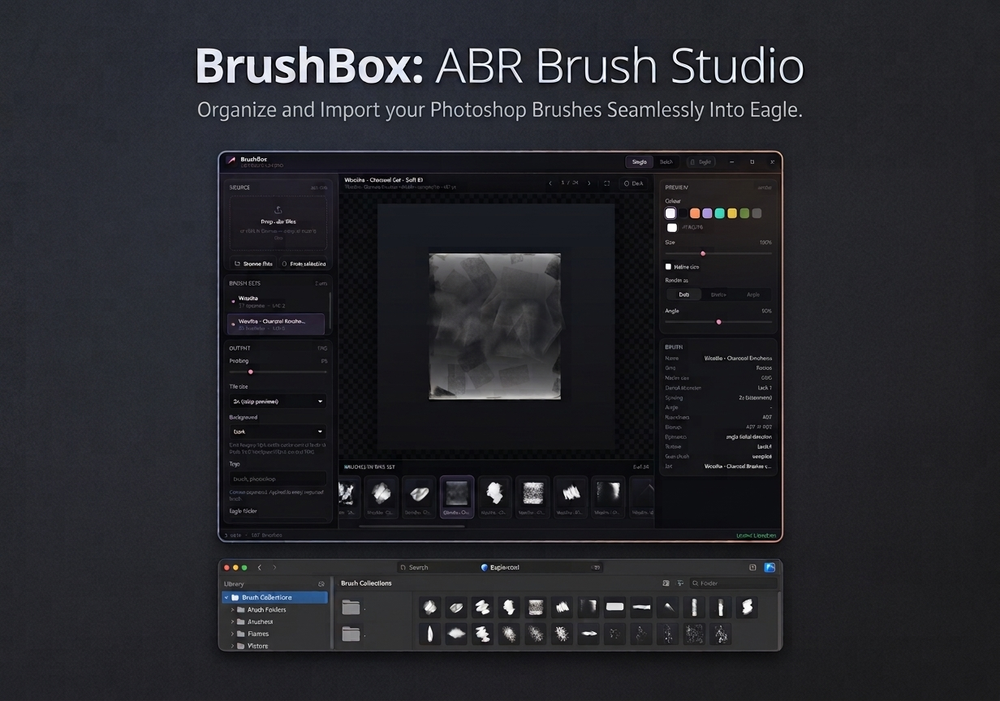
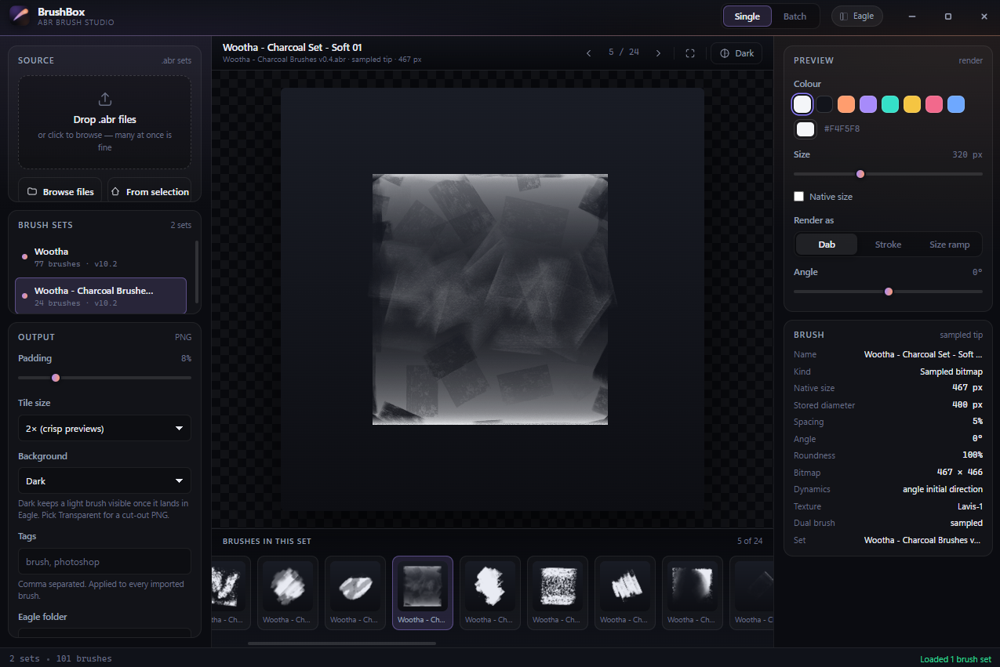
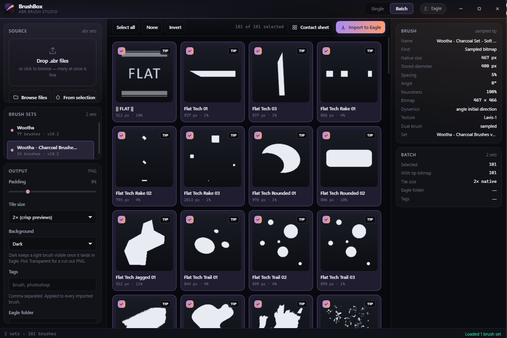

# BrushBox

**An [Eagle](https://eagle.cool) plugin for Adobe Photoshop `.abr` brush files** — open a brush set,
preview every brush in it at full quality, and import the ones you want into your Eagle library as
PNGs.

Single mode for studying one brush. Batch mode for unpacking a whole library of sets.



---

## Features

**Reads the real file.** `.abr` is an undocumented Adobe format. BrushBox parses the binary
directly — both the brush bitmaps and the settings block — so it shows you the actual brush tips
rather than guessing at them from the file size.

**Previews honestly.** A brush is drawn the way Photoshop defines it: computed tips from their
diameter / hardness / angle / roundness, sampled tips from their embedded bitmap, with rotation,
roundness squash and X/Y flips applied.

| Preview mode | What it shows |
| --- | --- |
| **Dab** | A single stamp at a chosen size |
| **Stroke** | Dabs laid along a curve at the brush's own spacing |
| **Size ramp** | The same brush at six sizes, so the falloff stays readable |

**Single mode** — step through a set with `←` / `→` or the filmstrip, and inspect each brush's
metadata: kind, native size, spacing, hardness, angle, roundness, dynamics, texture and dual-brush
settings.



**Batch mode** — every brush from every loaded set in one grid. Tick what you want and import the
selection in one pass: each brush becomes its own PNG item, with your tags, a target folder, and an
annotation recording the source set and brush metrics.



**Contact sheet** — export a single labelled overview PNG of everything selected.

**Other things it does**

- Drag and drop `.abr` files anywhere in the window, or use the native file picker
- Open `.abr` files you already have selected in Eagle
- Set padding, tile size (native / 2× / 4× / fixed 512 / fixed 1024), and background
  (dark, transparent, light, checker)
- Follows Eagle's light and dark themes
- Colour, size, angle and render mode are all adjustable live

---

## Requirements

- **Eagle** desktop app (Windows or macOS — Eagle does not run on Linux).
  BrushBox uses only long-standing plugin APIs. The single newer call it makes — re-selecting the
  items it just imported — is feature-detected, so on older builds everything still works and that
  one convenience step is simply skipped.
- **A Photoshop `.abr` brush file** — versions 6, 7, 9 or 10. (Versions 1 and 2 predate the modern
  format and are not supported; see [Format support](#format-support).)
- **No dependencies.** Nothing to install, nothing to build.

---

## Installation

BrushBox is a window plugin and needs no build step — the folder *is* the plugin.

### Via the Eagle Plugin Center

Install it from Eagle's plugin panel (`P`) once it is listed there.

### From source (recommended while developing)

1. Open Eagle.
2. **Plugin → Developer Options → Import Local Project**, then choose this folder.
3. Launch it from the plugin list. Edits to the JS/CSS take effect on the next launch
   (or press `F12` in the plugin window and reload).

### Manual install

Copy this folder into Eagle's plugin directory and restart Eagle:

| Platform | Path |
| --- | --- |
| Windows | `%APPDATA%\Eagle\Plugins\brushbox` |
| macOS | `~/Library/Application Support/Eagle/Plugins/brushbox` |

### Packaging for distribution

The simplest route is the built-in packager:

```bash
npm run package          # writes dist/BrushBox-<version>.eagleplugin
```

A `.eagleplugin` is just a ZIP holding the runtime files at its root, so the script writes one
directly — an explicit allowlist, no build step, and no dependency on having Eagle open. It is
byte-for-byte reproducible, which means two builds of the same source produce an identical file.

You can also do it in Eagle: open the plugin panel (`P`), right-click the plugin, and choose
**Pack Plugin**.

Either way, only these files belong in the package:

```
manifest.json   logo.png   index.html
css/style.css
js/bridge.js    js/abr.js   js/render.js   js/app.js
```

Exclude `test/`, `tools/`, `docs/`, `assets/`, `dist/`, `package.json`, `README.md` and
`.gitignore`. The packager enforces this: it refuses to run if a runtime file is missing and will
never include a development path.

---

## Usage

### 1. Load a brush set

Drop `.abr` files anywhere in the window, click **Browse files**, or press **From selection** to
open files you already have selected in Eagle. Loading several at once is fine.

Re-loading something already open is a no-op — BrushBox identifies a set by its *content*, so
however it arrives (dragged, browsed, or picked up from your Eagle selection) it will not pile up
duplicates. If the file has changed on disk, loading it again replaces the stale copy.

### 2. Inspect brushes

In **Single** mode, step through the set with `←` / `→` or click the filmstrip. The right-hand
panel shows what the file actually says about the brush. Press `B` to cycle the preview backdrop.

### 3. Choose your output

Everything under **Output** in the left rail applies to every export and import:

| Setting | Options |
| --- | --- |
| Tile size | native, 2×, 4×, fixed 512 px, fixed 1024 px |
| Background | dark, transparent, light, checker |
| Padding | 0–40% around the brush |
| Tags | comma separated, applied to every imported item |
| Eagle folder | where imported brushes land |

The background defaults to **Dark**, matching the stage, so imported brushes stay legible in
Eagle's library whatever theme you use. Choose **Transparent** if you want cut-out PNGs — but note
the default brush colour is near-white, so pair it with a darker colour or the result will be
invisible against a light view.

### 4. Export or import

- **Import to Eagle** (batch mode) — imports every ticked brush. Brushes start all-selected, so
  this is usually one click. Imports of more than 100 items ask for confirmation first.
- **Contact sheet** (batch mode) — one labelled PNG of the whole selection.
- **`Ctrl` / `Cmd` + `S`** — saves the current brush as a PNG wherever you choose.

Saving never replaces a file. If the folder you pick already holds a PNG of that name, BrushBox
writes beside it instead — `Soft Round.png` becomes `Soft Round (2).png` — and says which name it
used and which file it left untouched. The name is claimed by creating the file exclusively, so an
existing PNG cannot be overwritten even if something else creates it at the same moment.

Double-click a card in batch mode to open that brush in single mode.

### Keyboard

| Key | Action |
| --- | --- |
| `←` / `→` | Previous / next brush (single mode) |
| `B` | Cycle the preview backdrop (single mode) |
| `Ctrl` / `Cmd` + `S` | Save the current brush as a PNG |

---

## Privacy & data

**BrushBox runs entirely on your machine. It makes no network requests, has no telemetry, requires
no account, and sends nothing anywhere.**

- **What it reads** — only the `.abr` files you explicitly choose, and only to display them.
  It never modifies, moves, or deletes them.
- **What it writes** — rendered PNGs. During an import, each PNG is staged in your operating
  system's temporary folder, handed to Eagle, and deleted immediately afterwards. Anything a
  previous session left behind is swept on start-up — and only files BrushBox staged itself are
  ever swept, so nothing else in that folder is touched. When you use **Save PNG** or **Contact
  sheet**, the file is written to the folder you pick — and a file that is already there is never
  replaced: the export takes the next free name and the interface names both files.
- **What it changes in Eagle** — nothing until you ask. Only **Import to Eagle** adds items to your
  library, and only for the brushes you ticked.
- **No third-party code.** The plugin has no dependencies and bundles no external libraries.

The only outbound connections in this repository are made by the *development* preview server
(`tools/preview.js`), which serves files over `localhost` for local browsing. It is not part of the
shipped plugin.

---

## Troubleshooting

**Every brush in a set renders as the same soft blob.**
This is the symptom of a bitmap-to-preset join failure. It was fixed for the known causes (a NUL
terminator counted in descriptor string lengths, and a size guard that rejected large tips), but if
you still see it, find out exactly what the parser made of your file:

```bash
npm run inspect -- "path/to/your.brushes.abr"
```

The join report will show whether presets are matching their bitmaps. Please include that output in
a bug report.

**A brush is missing its texture / looks flatter than in Photoshop.**
Textures and dual brushes are read and displayed in the metadata panel, but previews render the tip
alone. The `patt` pattern block is skipped. This is a known limitation, not a bug.

**"This is a Photoshop 1 or 2 era brush file…"**
Versions 1 and 2 predate the modern block format and use a completely different layout. Re-save the
set from a modern Photoshop to convert it.

**Import does nothing, or reports that Eagle is unavailable.**
The plugin is running outside Eagle (for example in the development preview server). Previews and
export settings work there, but importing requires the Eagle runtime.

**Nothing happens when I drop files.**
Only `.abr` files are accepted. Anything else is ignored, and a toast will tell you if a file could
not be read.

**The window is too small to show everything.**
Use a window at least 1040 px wide. Below that the right-hand inspector is hidden, and below
1180 px both side panels narrow.

---

## Project structure

```
brushbox/
├─ manifest.json          Eagle plugin manifest (frameless window)
├─ logo.png               Plugin icon, 128×128
├─ index.html             Markup only — no logic
├─ css/
│  └─ style.css           Design tokens, window chrome, controls, stage, grid
├─ js/
│  ├─ abr.js              .abr binary parser — no DOM, no Eagle API, no dependencies
│  ├─ render.js           Brush → pixels (canvas 2D)
│  ├─ bridge.js           The only file that touches Eagle or the filesystem
│  └─ app.js              UI state, wiring, import/export flows
├─ tools/
│  ├─ make-logo.js        Draws logo.png (zlib-only PNG writer, no image libraries)
│  ├─ make-package.js     Builds dist/BrushBox-<version>.eagleplugin (hand-written ZIP)
│  ├─ inspect-abr.js      CLI: what the parser made of a file, incl. the join report
│  └─ preview.js          Local dev server for inspecting the UI in a browser
├─ test/
│  ├─ run-tests.js        Parser + renderer tests; writes .abr fixtures and reads them back
│  ├─ check-plugin.js     Static checks: id contract, assets, manifest, layering
│  ├─ fixtures/           Generated on each test run (gitignored)
│  └─ real/               Drop your own .abr files here to have them tested (gitignored)
├─ assets/
│  ├─ hero.jpg                    Listing cover artwork
│  ├─ screenshot-single-mode.png  Single-brush view
│  └─ screenshot-batch-mode.png   Batch grid
├─ docs/
│  ├─ abr-format-spec.md  Byte-level specification of the .abr container
│  └─ eagle-api-notes.md  Notes on the Eagle Plugin API
```

The layering is deliberate and enforced by `test/check-plugin.js`:

- `js/abr.js` touches **no DOM and no Eagle API**, so the parser is testable in plain Node.
- **Only `js/bridge.js` talks to Eagle**, so the UI can be previewed in any browser and the rest of
  the plugin can be reasoned about without an Eagle runtime.

---

## Development

There is nothing to install — everything runs on Node's standard library.

```bash
npm test              # parser tests + plugin integrity checks
npm run test:parser   # writes .abr files byte by byte, then reads them back
npm run test:plugin   # id contract, assets, manifest, layering invariants
npm run inspect       # npm run inspect -- path/to/file.abr
npm run package       # build dist/BrushBox-1.0.1.eagleplugin
npm run logo          # regenerate logo.png at 128×128
npm run preview       # serve the UI at http://127.0.0.1:8791
```

### How the tests work

The parser tests do not rely on checked-in fixtures. `test/run-tests.js` **writes** `.abr` files
byte by byte — an independent encoder for the 8BIM blocks, Photoshop descriptors and PackBits —
then reads them back. A pass therefore means the parser agrees with a *separate* implementation of
the format, rather than with itself. Generated files land in `test/fixtures/` and can be opened in
Eagle to eyeball the result.

Synthetic fixtures only prove self-consistency, so there is also a fuzz suite (random bit flips,
truncation at every offset, random noise, and a stall attempt) and an optional real-file check:
**drop any `.abr` into `test/real/`** and it is parsed and asserted on — brushes found, every
sampled brush joined to its bitmap, no two brushes collapsing to one render, no stray NUL
characters. That directory is gitignored; bring your own files. It is the check that catches
conventions no hand-written fixture reproduces.

### Inspecting a file

```bash
npm run inspect -- path/to/brushes.abr          # block layout + join report
npm run inspect -- path/to/brushes.abr --ids    # bitmap ids against preset ids
npm run inspect -- path/to/brushes.abr --codes  # raw strings, escaped
npm run inspect -- path/to/brushes.abr --masks  # per-mask coverage statistics
```

### Previewing the UI

`npm run preview` serves the real markup and scripts over HTTP so the interface can be inspected in
a browser. It has no access to Eagle, and the plugin degrades cleanly without it. Append
`?demo=single`, `?demo=stroke`, `?demo=ramp`, `?demo=batch` or `?demo=real` to load files through
the same paths a real user would take.

For a genuine end-to-end check, drop an `.abr` into the plugin window inside Eagle and use
**Import to Eagle**. The plugin logs to Eagle's app log, tagged `[brushbox]`.

---

## Format support

BrushBox reads the modern `.abr` block format — **versions 6, 7, 9 and 10**, minor versions 1
and 2 — including:

- `samp` bitmaps at 8- and 16-bit depth, raw and PackBits/RLE compressed
- the `desc` descriptor block: computed, sampled, bristle and erodible tips, plus shape dynamics,
  scatter, texture and dual-brush metadata
- sample-to-preset joining by the `sampledData` GUID, tolerant of either block order. A dual brush
  references a *second* tip the same way, and that tip counts as used — many real sets point at
  some of their bitmaps only through a dual brush, so ignoring it makes almost every file look like
  it is shedding bitmaps

  Photoshop counts a trailing NUL in descriptor string lengths — which is why the format spec
  reports `sampledData` as `TEXT 37` for a 36-character UUID. That byte has to be stripped, or no
  preset ever joins to its bitmap and every sampled brush falls back to a synthesised tip, making a
  whole set look like the same soft blob.
- mask bytes passed through exactly as stored. Their polarity is never second-guessed: "opaque
  corners, empty centre" reads like a black-on-white tip, but it is equally a hollow rectangle
  stamp, and real files contain plenty of those.
- unknown or empty blocks, which are skipped by length rather than treated as fatal

Tips larger than 2048 px (Photoshop allows brushes up to 5000 px) are decoded at full size and then
stored downscaled, with the original dimensions kept for display. Nothing that can be drawn is
lost — the renderer's own output ceiling is 2048 — but it stops a set of large brushes from holding
hundreds of megabytes of pixels that would only ever be scaled down.

Two things it deliberately does **not** do:

- **Versions 1 and 2** use a completely different, pre-Photoshop 6 layout. They are detected and
  reported with a clear message rather than mis-parsed.
- **Texture rendering.** Texture and dual-brush settings are read and displayed, but previews show
  the tip alone; the `patt` pattern block is skipped.

### One implementation note

The bitmap inside a version 6.2 `samp` item lives in a *virtual memory array list*, and the
widely-copied shortcut is to skip a flat 264 bytes to reach it. That constant is derived, not
documented — it only holds when the array declares 56 channels with the bitmap in the last one.
BrushBox walks the channel records properly (`readVirtualMemoryBitmap` in `js/abr.js`), accepting a
record only when its declared payload length exactly matches its bounds, depth and compression, and
keeps the flat offset purely as a fallback.

`docs/abr-format-spec.md` has the full byte-level detail.

---

## Credits

The `.abr` container is undocumented. This parser was written against reverse-engineered
descriptions and cross-checked with several independent implementations:

- [ag-psd](https://github.com/Agamnentzar/ag-psd) (MIT) — `abr.ts` / `descriptor.ts`, the de-facto
  reference for the block and descriptor structures
- The [Eagle Plugin API](https://developer.eagle.cool/plugin-api/) documentation
- Alexandre Prokoudine's reverse-engineered ABR specification (0xfeedface.org, via the Internet
  Archive) and the
  [Just Solve the File Format Problem](http://fileformats.archiveteam.org/wiki/Photoshop_brush)
  wiki entry
- Adobe's *Photoshop File Formats Specification* for the shared descriptor and PackBits structures

Research notes and the full byte-level specification are in `docs/`.

### Brushes in the screenshots

The screenshots above show brushes from **Stéphane "Wootha" Richard's public-domain brush set**,
made available under the *Do Whatever You Want To Public License*:

- [Wootha Public Domain on the Internet Archive](https://archive.org/details/Wootha_Public_Domain)
- © 2020 Stéphane "Wootha" Richard — `art@wootha.com` (per the archive's `LICENSE.txt`)

That licence covers the brush artwork in the images only. The plugin code in this repository is
covered by the MIT licence below.

---

## Contact

Questions, bug reports and feature requests are welcome:

- **GitHub:** [Stef4678/brushbox](https://github.com/Stef4678/brushbox) — please
  [open an issue](https://github.com/Stef4678/brushbox/issues)
- **Email:** stefaninfp@gmail.com

When reporting a brush file that does not display correctly, the output of
`npm run inspect -- yourfile.abr` is enormously helpful — it shows exactly how the file was parsed.

---

## License

Released under the MIT License.

MIT © 2026 Kerekes Stefan
